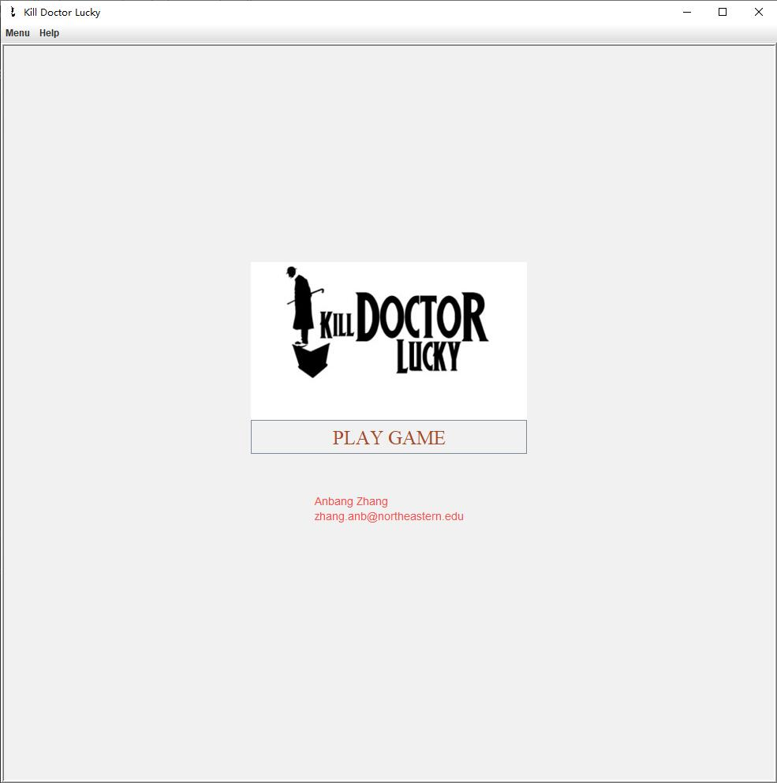
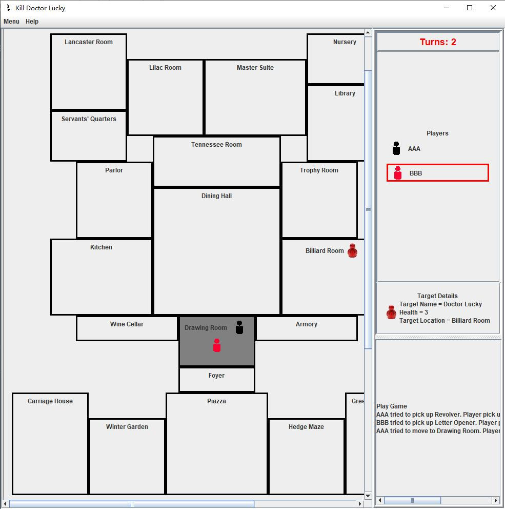

 # 5010-project-anbangzhang

 name: Anbang Zhang
 
 preferred name: Anbang

 email: zhang.anb@northeastern.edu
 
 
 
 # Project Introduction

 This project is the project of CS5010, and it's a board game that is loosely inspired by Doctor Lucky series of games.
 
 Running this project will create a graphical image of the world specified in the input txt file.

 # Input File Format

 The input file specifies the world map in the following four sections, you can refer to the sample _/res/world specification/mansion.txt_.
  
  1. World description including the size, the name, and the target character.
  2. The pet information.
  3. A detailed list of all of the spaces or rooms that make up the world.
  4. A detailed list of all of the items that can be found in the world.
  
 Each section is specified as follows:
  
  * World description consists of two lines:
  
     - the first line contains the number of rows, the number columns, and the name of the world
     - the second line contains the health and name of the target character
  
  * The pet name is listed
  
  * Spaces or rooms are specified in an ordered, 0-indexed list. The first line of this section contains a single number that represents the number of spaces or rooms that make up the world. Then each space or room is specified on its own line containing:
  
     - (row, col) of the upper left corner
     - (row, col) of the lower right corner
     - the name of the space or room
  
  * Items are also specified in an ordered list. The first line of this section contains a single number that represents the number of items. Then each item is specified on its own line containing:
  
     - the index of the room in which the item can be found
     - the amount of damage the item could do if it was used to attack the target character
     - the name of the item

 # Features
 
 1. Display information about a specified space on the view.
 2. Create a graphical representation of the world map and provide the ability to save the graphical representation to a file as a PNG file.
 3. Allow users to restart game or start game with new game settings.
 4. Add a human-controlled player to the game.
 5. Add a computer-controlled player to the game.
 6. Allow a player to Move. This represents a turn.
 7. Allow a player to pick up an weapon. This represents a turn.
 8. Allow a player to look around. This represents a turn.
 9. Allow a player to move the Pet to a different space. This represents a turn.
 10. Allow a player to attack the Target with/without a weapon. This represents a turn.
 11. Display a description of a specific player.
 12. Game ends when:
     - the maximum number of turns is reached in which case the target character escapes and runs away to live another day and nobody wins.
     - a player successfully kills the target character in which case they win the game.
 13. Automatically move the Target character around the world after every turn.
 14. Automatically move the Target character's pet around the world after every turn using DFS.
 15. Hints are displayed before every move.

 

 # How to Run

 The Jar file can be executed with the following instructions:
 1. Open the terminal line and navigate to the folder where the jar is located on your PC.
 2. Execute the following command:

        java -jar WorldDriver.jar `input_file_name` `turn_amount` `maximum_players` `game_mode`

    Sample:

        java -jar WorldDriver.jar "./world specification/mansion.txt" 2 10 TEXT

 The above command is going to take `mansion.txt` file as input world specification, specify that there are `2` rounds in the game, at most `10` players in the game, and run in `TEXT` mode.
 
 The valid value for `game_mode` is `GUI` and `TEXT`.

 # Example Run
 
 There are two example runs in the `res/example/` directory.
 
 **Run 1**

 * Start the program with `./world specification/mansion.txt` as the world specification and `2` as the turn amount.
 
 * Create a human-controlled player, its name is `Human`, its starting space index is `0`, its weapon limit is `4`.
 
 * Create a computer-controlled player, its name is `Computer`, its starting space index is `1`, its weapon limit is `2`.
 
 * Quit player creation process.
 
 * Start the game.
 
 * At the start of each turn of the game, the target's detail, the pet and evidences are displayed.
 
 * In the 1st turn, human-controlled player `Human` attacks the target without a weapon, causing `1` damage.
 
 * In the 1st turn, computer-controlled player `Computer` picks up the weapon `Billiard Cue`.
 
 * The target moves to `Billiard Room` and the pet moves to `Drawing Room`.
 
 * At the start of each turn of the game, the target's detail, the pet and evidences are displayed.
  
 * In the 2nd turn, human-controlled player `Human` picks up the weapon `Revolver`.
  
 * In the 2nd turn, computer-controlled player `Computer` attacks the target with weapon `Billiard Cue`, causing `2` damage, the target died.
 
 * The game ends, display the winner computer-controlled player `Computer`, the pet position and evidences. Each player's detail is displayed.
 
 **Run 2**

 * Start the program with `./world specification/mansion.txt` as the world specification and `2` as the turn amount.
 
 * Create a computer-controlled player, its name is `Computer`, its starting space index is `0`, its weapon limit is `2`.
 
 * Create a human-controlled player, its name is `Human`, its starting space index is `0`, its weapon limit is `3`.

 * Quit player creation process.
 
 * Start the game.
 
 * At the start of each turn of the game, the target's detail, the pet and evidences are displayed.
 
 * In the 1st turn, computer-controlled player `Computer` attacks the target without a weapon, causing `1` damage.
 
 * In the 1st turn, human-controlled player `Human` picks up the weapon `Billiard Cue`.
 
 * The target moves to `Billiard Room` and the pet moves to `Drawing Room`.
 
 * At the start of each turn of the game, the target's detail, the pet and evidences are displayed.
  
 * In the 2nd turn, computer-controlled player `Computer` picks up the weapon `Revolver`.
  
 * In the 2nd turn, human-controlled player `Human` attacks the target with weapon `Billiard Cue`, causing `2` damage, the target died.
 
 * The game ends, display the winner human-controlled player `Human`, the pet position and evidences. Each player's detail is displayed.
 
 **Run 3**
 
 * Start the program with `./world specification/mansion.txt` as the world specification and `2` as the turn amount.

 * Create a human-controlled player, its name is `Human1`, its starting space index is `0`, its weapon limit is `5`.
 
 * Create a human-controlled player, its name is `Human2`, its starting space index is `0`, its weapon limit is `6`.

 * Create a computer-controlled player, its name is `Computer1`, its starting space index is `1`, its weapon limit is `4`.
 
 * Create a computer-controlled player, its name is `Computer2`, its starting space index is `1`, its weapon limit is `2`.
 
 * Quit player creation process.
 
 * Start the game.
 
 * At the start of each turn of the game, the target's detail, the pet and evidences are displayed.
 
 * In the 1st turn, human-controlled player `Human1` fails to attack the target without a weapon, because the attack is seen by player `Human2` in the same space.
 
 * In the 1st turn, human-controlled player `Human2` looks around the space, the information of current space and its neighbors are displayed.
 
 * In the 1st turn, computer-controlled player `Computer1` picks up the weapon `Billiard Cue`.
 
 * In the 1st turn, computer-controlled player `Computer2` looks around the space, the information of current space and its neighbors are displayed, but the space `Armory` is not visible because the pet is in it.
 
 * The target moves to `Billiard Room` and the pet moves to `Drawing Room`.
 
 * At the start of each turn of the game, the target's detail, the pet and evidences are displayed.
 
 * In the 2nd turn, human-controlled player `Human1` moves the pet to space `Dining Hall`.
 
 * In the 2nd turn, human-controlled player `Human2` moves to space `Drawing Room`.
 
 * In the 2nd turn, computer-controlled player `Computer1` fails to attack the target with weapon `Billiard Cue`, because the attack is seen by player `Computer2` in the same space.
 
 * In the 2nd turn, computer-controlled player `Computer2` fails to attack the target without a weapon, because the attack is seen by player `Computer1` in the same space.

 * The target moves to `Carriage House` and the pet moves to `Wine Cellar`.
 
 * The game ends, the target escaped with health `3`, no winner, the pet position and evidences are displayed. Each player's detail is displayed.
 
 **Run 4**
 
 * Start the program with `./world specification/mansion.txt` as the world specification and `2` as the turn amount.

 * Create a computer-controlled player, its name is `Computer1`, its starting space index is `3`, its weapon limit is `4`.

 * Create a computer-controlled player, its name is `Computer2`, its starting space index is `1`, its weapon limit is `2`.

 * Create a human-controlled player, its name is `Human`, its starting space index is `0`, its weapon limit is `2`.
 
 * Quit player creation process.
 
 * Start the game.
 
 * At the start of each turn of the game, the target's detail, the pet and evidences are displayed.
 
 * In the 1st turn, computer-controlled player `Computer1` looks around the space, the information of current space and its neighbors are displayed, but the space `Armory` is not visible because the pet is in it. 
 
 * In the 1st turn, computer-controlled player `Computer2` picks up the weapon `Billiard Cue`.

 * In the 1st turn, human-controlled player `Human1` moves the pet to space `Winter Garden`.

 * The target moves to `Billiard Room` and the pet moves to `Piazza`.
 
 * At the start of each turn of the game, the target's detail, the pet and evidences are displayed.
 
 * In the 2nd turn, computer-controlled player `Computer1` looks around the space, the information of current space and its neighbors are displayed.
 
 * In the 2nd turn, computer-controlled player `Computer2` fails to attack the target with weapon `Billiard Cue`, because the attack is seen by player `Computer1` from the neighbor space.
 
 * In the 2nd turn, human-controlled player `Human` moves to space `Drawing Room`.
 
 * The target moves to `Carriage House` and the pet moves to `Hedge Maze`.
 
 * The game ends, the target escaped with health `3`, no winner, the pet position and evidences are displayed. Each player's detail is displayed.
 
 # Game Instructions
 
 ## TEXT Mode

 The program is going to print some instructions to guide you
 
 **Create Player**

 Select player type:
 
    Please input the type of player to create:
            1. human-controlled
            2. computer-controlled
            q. quit creating

 Input player name:

    Please input the name of player:

 Input player space index:

    Please input the space index that the player created at:
  
 Input player weapon limit:
 
    Please input the weapon limit of player, -1 indicates no limit:
 
 **Game Menu** 
 
    Please input the number below to select the function:
            1. displayAllSpaces
            2. displaySpaceDetail
            3. generateGraphicalImage
            4. startGame
            q. exit

 Input space index:
 
    Please input the space index:
 
 Input image output directory:
 
    Please input the output directory:
 
 Player action selection:
 
    Please use the number below to select the action for player [Human]
            1. move player to a neighbor space.
            2. pick up a weapon in the space.
            3. look around the space.
            4. move pet to a new space.
            5. attack target.
 
 Input neighbor name:
 
    Please input a neighbor space name from the neighbors: [Dining Hall, Parlor, Wine Cellar]
 
 Input weapon name:
 
    Please input a weapon name from the weapons: [Rat Poison, Piece of Rope]
 
 Input the space name:
 
    Please input a space name from the spaces: [Armory, Billiard Room, Carriage House, Dining Hall, Drawing Room, Foyer, Green House, Hedge Maze, Kitchen, Lancaster Room, Library, Lilac Room, Master Suite, Nursery, Parlor, Piazza, Servants' Quarters, Tennessee Room, Trophy Room, Wine Cellar, Winter Garden]

 ## GUI Mode
 
 Upon program launch, the program creates a world instance based on the world specification file. Then the user is presented with welcome screen with 2 main menus:

 **Menu**
 
 1.1 New Game - Allows user to create a new game with new world configuration:
 
         Game setting example:
         res/world specification/Mansion.txt - Name of the file with World Specification.
         4 - Number of turns for the game.
         10 - Maximum number of players allowed in the game.
 
 1.2 Restart Game - Allows user to start the game with the previous settings.
 
 1.3 Add Player - Allows user to add a player to the game.
 
         Player setting example: 
         Player Name:`AAA` 
         Start Room:`Armory` 
         Player's Weapon Limit: -1 for no limit of the capacity
                                 5 maximum is 5 weapons
         Type of Player: computer Player
 
 1.4 Quit Game - Allows user to quit the game.
 
 **Help**
 
 1.1 About Game - Displays a brief introduction of the functions and features of the game.
 
 1.2 How to Play Game - Displays information on how to play the game.
 
 Game Player Hot Keys:
 
 1. Press l  player can look around
 2. Press a  player can attack the target.
 3. Press p  player can pick up a weapon from the space.
 
 Mouse Click:
 
 1. Click on a player's icon displays player's description.
 2. Click on target's icon displays target's information.
 3. Click on a neighbor room, the current player moves to that room.
 4. Right Click on a room, the current player moves the pet to that room. 